# Arquitectura del Sistema

Documentación técnica de la arquitectura de Vestimenta Catán, siguiendo lineamientos ISO 9001 para trazabilidad y control de calidad.

## Tabla de Contenidos

- [Visión General](#visión-general)
- [Diagrama de Arquitectura](#diagrama-de-arquitectura)
- [Stack Tecnológico](#stack-tecnológico)
- [Arquitectura del Backend](#arquitectura-del-backend)
- [Arquitectura del Frontend](#arquitectura-del-frontend)
- [Modelo de Datos](#modelo-de-datos)
- [Flujo de Autenticación](#flujo-de-autenticación)
- [Flujo de Reservas](#flujo-de-reservas)
- [Infraestructura y Despliegue](#infraestructura-y-despliegue)
- [Decisiones de Arquitectura](#decisiones-de-arquitectura)

---

## Visión General

Vestimenta Catán es un sistema de gestión de inventario y reservas para ropa térmica. Utiliza una arquitectura **Cliente-Servidor** con separación clara entre frontend y backend, comunicándose a través de una API REST.

### Características Principales

- **Catálogo de productos** con variantes (talla, color, género)
- **Control de stock** en tiempo real
- **Sistema de reservas** con máquina de estados
- **Autenticación segura** con JWT y Google OAuth
- **Panel de administración** para gestión completa

---

## Diagrama de Arquitectura

### Arquitectura General

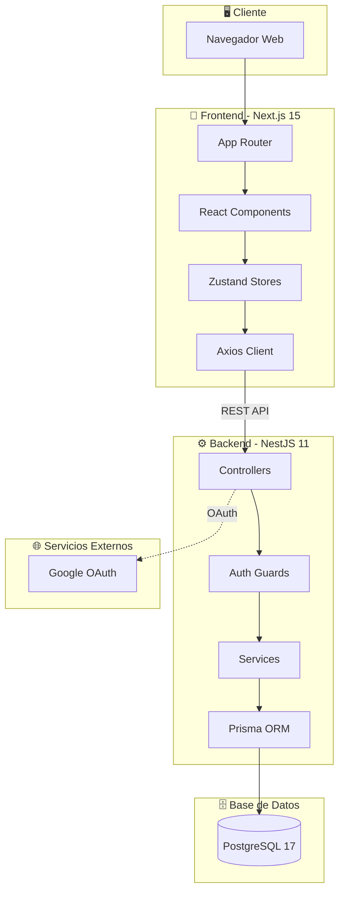

### Diagrama de Componentes

```mermaid
flowchart LR
    subgraph FE["Frontend (Next.js)"]
        direction TB
        Pages["📄 Pages<br/>(App Router)"]
        UI["🎨 UI Components<br/>(Radix UI)"]
        State["📦 State<br/>(Zustand)"]
        API["🔌 API Client<br/>(Axios)"]
    end

    subgraph BE["Backend (NestJS)"]
        direction TB
        Auth["🔐 Auth Module"]
        Users["👥 Usuarios Module"]
        Products["📦 Productos Module"]
        Variants["🏷️ Variantes Module"]
        Reservations["📋 Reservas Module"]
        Catalog["📚 Catálogo<br/>(Colores, Talles)"]
    end

    subgraph DB["Database"]
        PG[(PostgreSQL)]
    end

    FE -->|HTTP/REST| BE
    BE -->|Prisma| DB
```

---

## Stack Tecnológico

### Frontend

| Tecnología | Versión | Propósito |
|------------|---------|-----------|
| Next.js | 15 | Framework React con App Router |
| React | 19 | Librería UI |
| TypeScript | 5.x | Tipado estático |
| Tailwind CSS | 4 | Estilos utility-first |
| Zustand | 5.x | Estado global |
| Radix UI | latest | Componentes accesibles |
| Axios | 1.x | Cliente HTTP |

### Backend

| Tecnología | Versión | Propósito |
|------------|---------|-----------|
| NestJS | 11 | Framework Node.js |
| TypeScript | 5.x | Tipado estático |
| Prisma | 6 | ORM |
| PostgreSQL | 17 | Base de datos |
| Passport.js | 0.7 | Autenticación |
| Swagger | 8.x | Documentación API |
| Winston | 3.x | Logging |

### Infraestructura

| Tecnología | Propósito |
|------------|-----------|
| Docker | Contenedores |
| Docker Compose | Orquestación local |
| Nginx | Reverse proxy (producción) |
| GitHub Actions | CI/CD |

---

## Arquitectura del Backend

### Estructura Modular

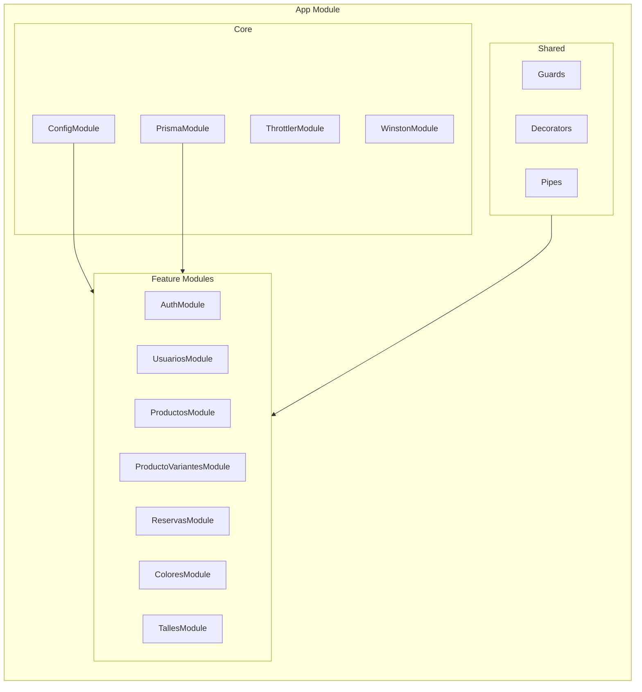

### Patrón por Módulo

Cada módulo sigue la estructura:

```
src/
  modulo/
    dto/
      create-modulo.dto.ts
      update-modulo.dto.ts
    modulo.controller.ts    # Endpoints REST
    modulo.service.ts       # Lógica de negocio
    modulo.module.ts        # Configuración del módulo
```

### Flujo de Request

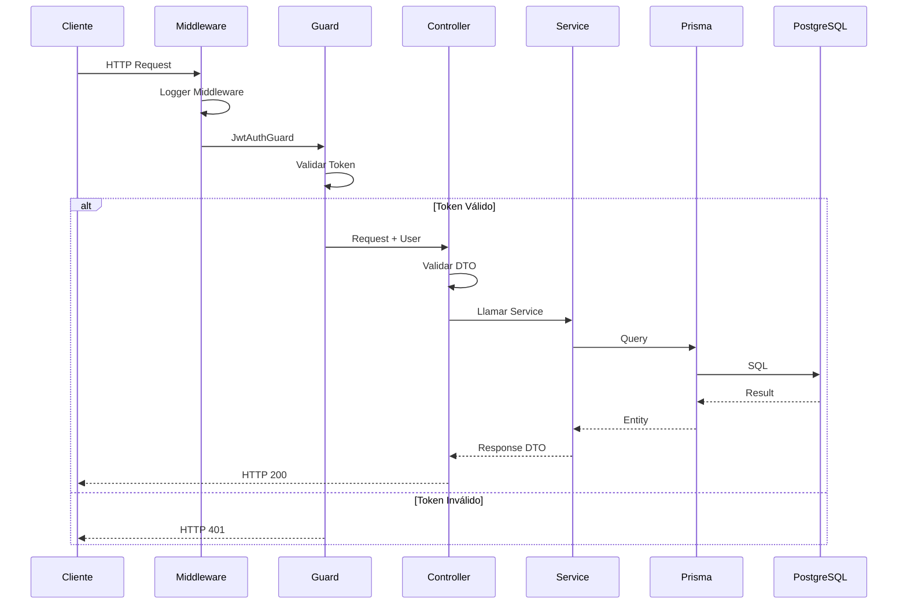

---

## Arquitectura del Frontend

### Estructura de Carpetas

```
src/
  app/                    # App Router (páginas)
    (auth)/              # Grupo de rutas auth
    (dashboard)/         # Grupo de rutas dashboard
    layout.tsx           # Layout principal
    page.tsx             # Home
  components/
    ui/                  # Componentes base (Radix)
    forms/               # Formularios
    layout/              # Header, Footer, etc.
  stores/
    auth-store.ts        # Estado de autenticación
    reservas-store.ts    # Estado de reservas
  hooks/
    use-auth.ts          # Hook de autenticación
    use-reservas.ts      # Hook de reservas
  lib/
    axios.ts             # Configuración de Axios
    utils.ts             # Utilidades
  types/
    index.ts             # Tipos TypeScript
```

### Gestión de Estado

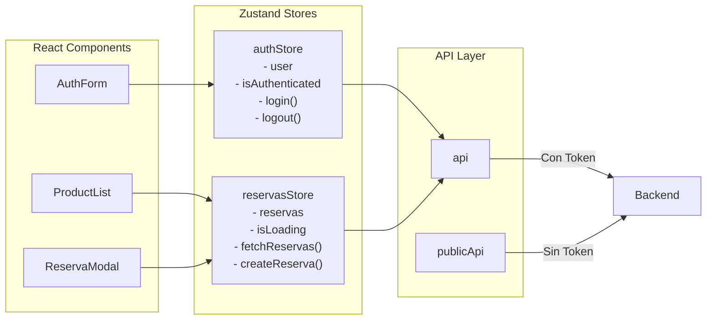

---

## Modelo de Datos

### Diagrama Entidad-Relación

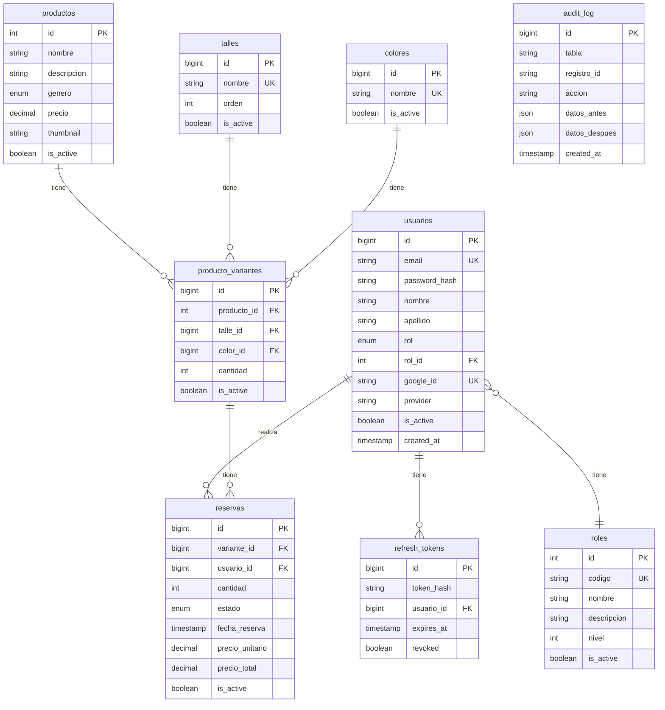

### Enums del Sistema

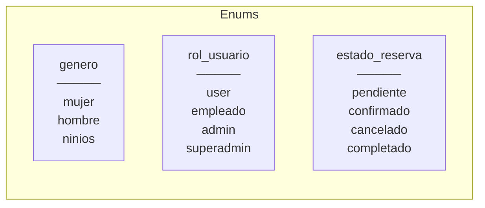

---

## Flujo de Autenticación

### Registro y Login

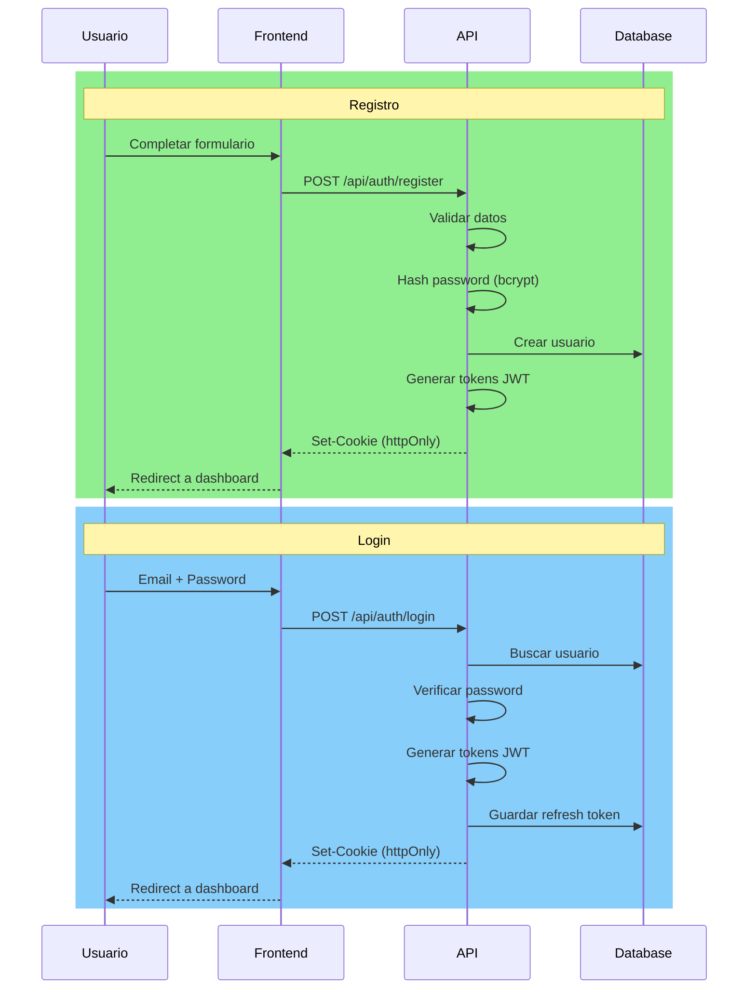

### Refresh Token Flow

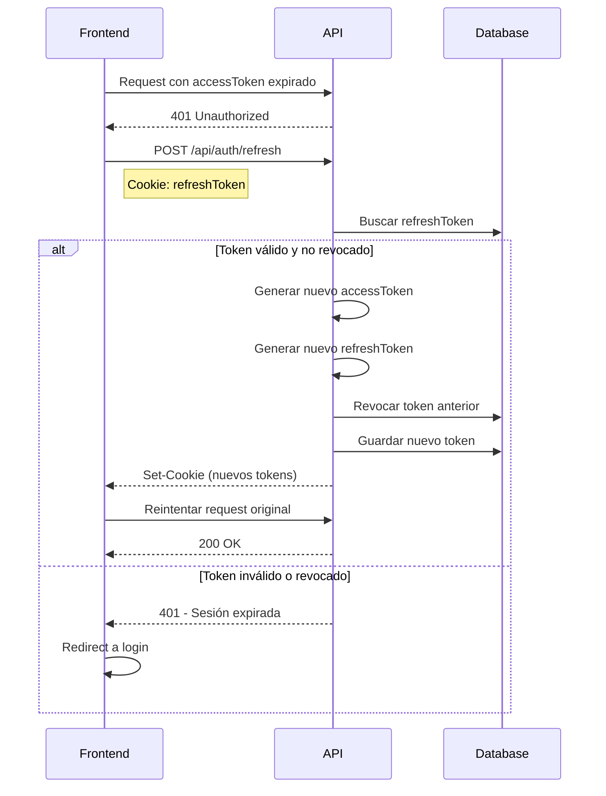

### Tokens y Cookies

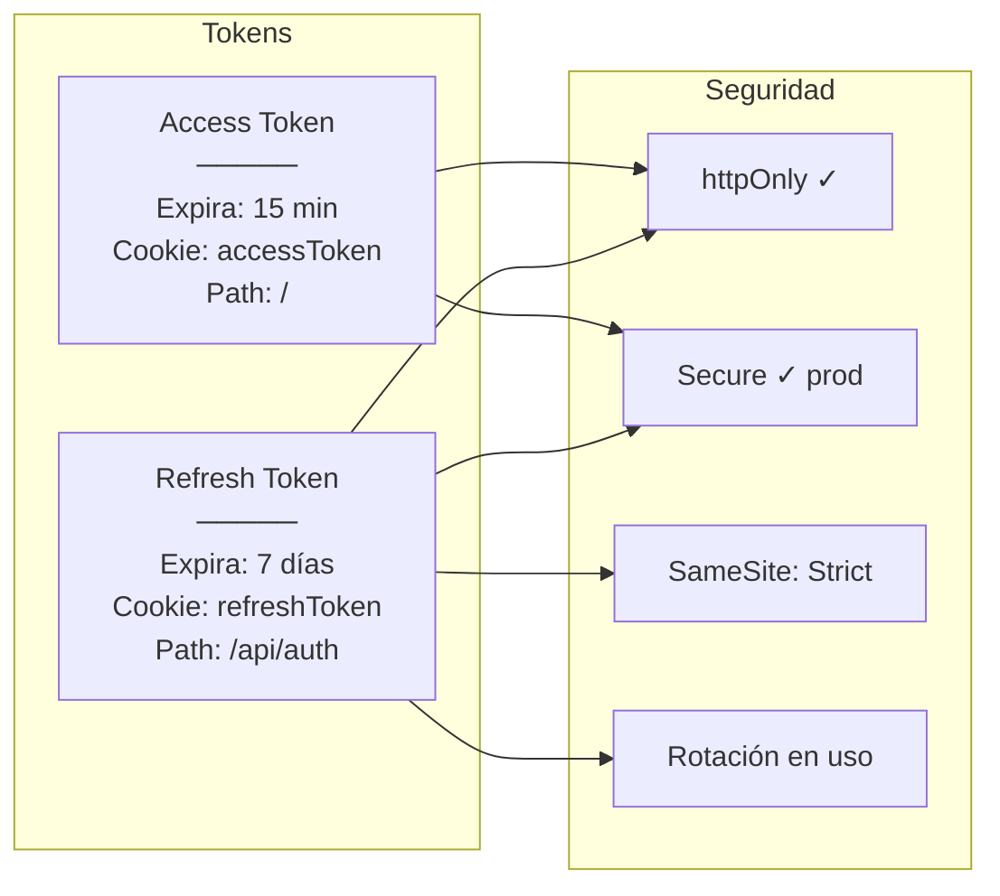

---

## Flujo de Reservas

### Máquina de Estados

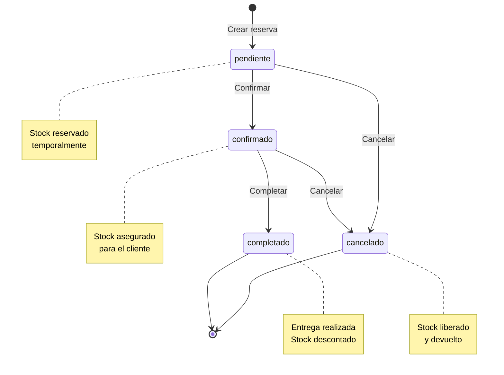

### Proceso de Reserva

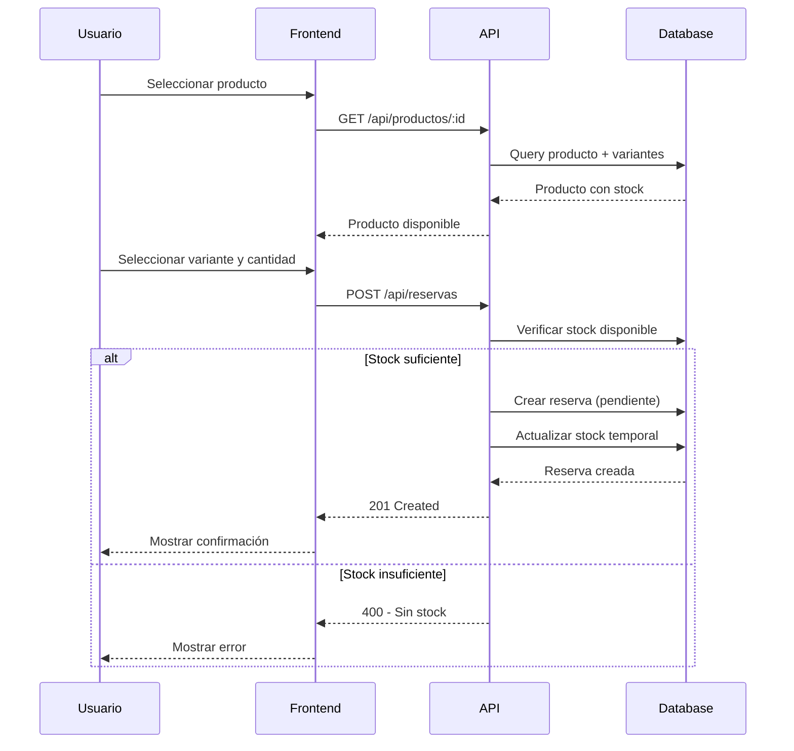

---

## Infraestructura y Despliegue

### Ambientes de Base de Datos

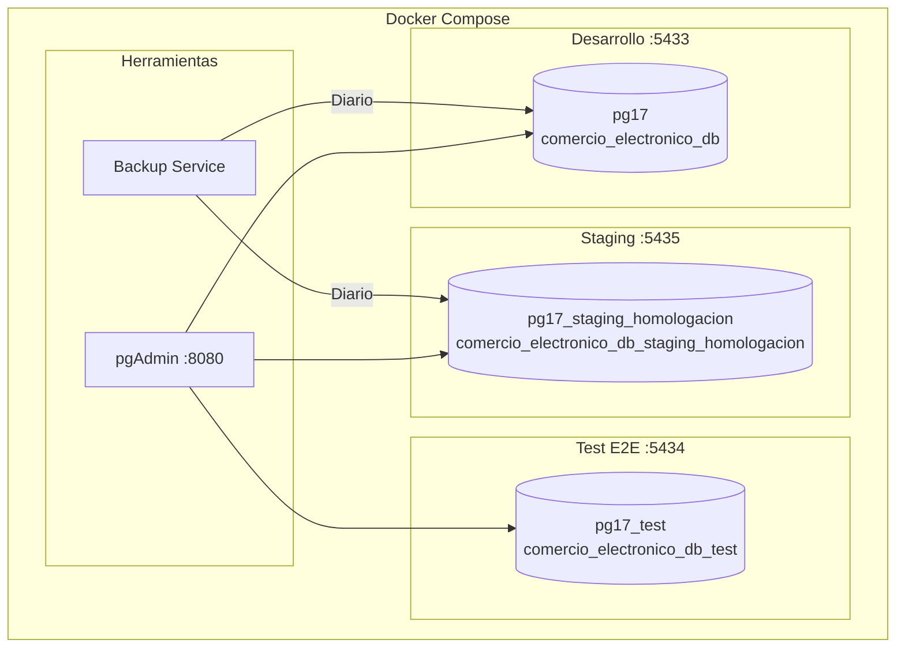

### Arquitectura de Producción

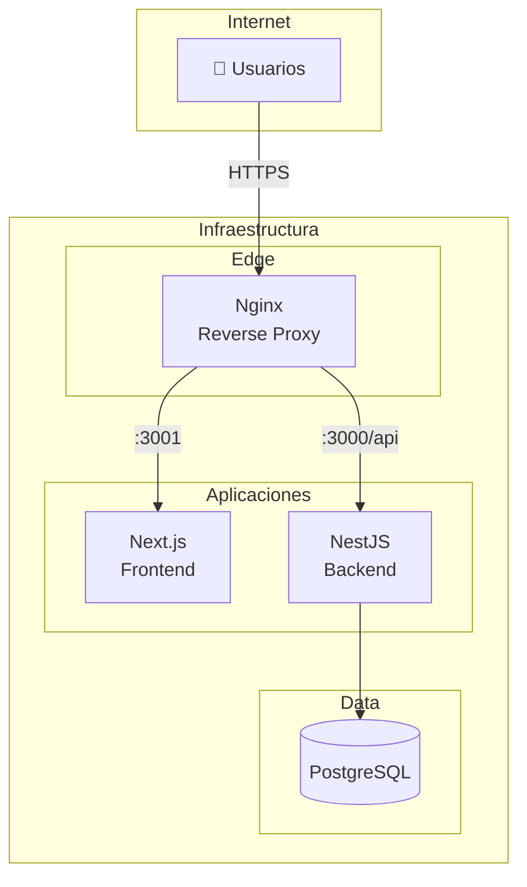

---

## Decisiones de Arquitectura

### ADR-001: Monorepo vs Multirepo

**Decisión**: Monorepo con carpetas separadas para frontend y backend.

**Contexto**: Necesitamos desarrollar frontend y backend de forma coordinada.

**Consecuencias**:
- ✅ Cambios coordinados en una sola PR
- ✅ Compartir tipos TypeScript fácilmente
- ✅ CI/CD unificado
- ⚠️ Repositorio más grande

### ADR-002: JWT en Cookies vs LocalStorage

**Decisión**: Tokens JWT almacenados en cookies httpOnly.

**Contexto**: Protección contra ataques XSS.

**Consecuencias**:
- ✅ Tokens no accesibles por JavaScript
- ✅ Protección contra XSS
- ✅ Envío automático en cada request
- ⚠️ Requiere configuración CORS correcta

### ADR-003: Prisma vs TypeORM

**Decisión**: Prisma ORM.

**Contexto**: Necesitamos un ORM moderno con buen soporte TypeScript.

**Consecuencias**:
- ✅ Type-safety excelente
- ✅ Migraciones declarativas
- ✅ Prisma Studio para debugging
- ⚠️ Menos flexible que SQL raw

### ADR-004: Soft Delete vs Hard Delete

**Decisión**: Soft delete en todas las tablas (`deleted_at`, `is_active`).

**Contexto**: Requisito de auditoría y posibilidad de recuperar datos.

**Consecuencias**:
- ✅ Trazabilidad completa
- ✅ Posibilidad de restaurar
- ✅ Historial de cambios
- ⚠️ Queries más complejas (filtrar por is_active)

### ADR-005: Zustand vs Redux

**Decisión**: Zustand para estado global.

**Contexto**: Necesitamos estado global simple para auth y reservas.

**Consecuencias**:
- ✅ API simple y concisa
- ✅ Menos boilerplate que Redux
- ✅ Persistencia fácil
- ⚠️ Menos herramientas de debugging

---

## Registro de Cambios

| Fecha | Versión | Cambios |
|-------|---------|---------|
| 2025-12-26 | 1.0 | Documento inicial |

---

**Última actualización**: 2025-12-26
**Versión del documento**: 1.0
