# Guía de Despliegue

Procedimientos de despliegue y rollback para Vestimenta Catán, siguiendo lineamientos ISO 9001 para control de cambios.

## Tabla de Contenidos

- [Ambientes](#ambientes)
- [Pre-requisitos](#pre-requisitos)
- [Despliegue Local](#despliegue-local)
- [Despliegue a Staging](#despliegue-a-staging)
- [Despliegue a Producción](#despliegue-a-producción)
- [Rollback](#rollback)
- [Checklist de Despliegue](#checklist-de-despliegue)
- [Troubleshooting](#troubleshooting)
- [Health Checks y Monitoreo](#health-checks-y-monitoreo)

---

## Ambientes

```mermaid
flowchart LR
    subgraph Environments
        Dev["💻 Desarrollo<br/>localhost"]
        Staging["📋 Staging<br/>staging.vestimenta-catan.com"]
        Prod["🚀 Producción<br/>vestimenta-catan.com"]
    end

    Dev -->|PR + Review| Staging
    Staging -->|Aprobación QA| Prod
```



| Ambiente | URL | Base de Datos | Puerto BD |
|----------|-----|---------------|-----------|
| Desarrollo | localhost:3000/3001 | comercio_electronico_db | 5433 |
| Test E2E | - | comercio_electronico_db_test | 5434 |
| Staging | staging.vestimenta-catan.com | comercio_electronico_db_staging_homologacion | 5435 |
| Producción | vestimenta-catan.com | comercio_electronico_db_prod | 5432 |

---

## Pre-requisitos

### Herramientas Requeridas

- Node.js >= 20.x
- pnpm >= 9.x
- npm >= 10.x
- Docker y Docker Compose
- Git

### Accesos Requeridos

- [ ] Repositorio Git (push access)
- [ ] Servidor de producción (SSH)
- [ ] Variables de entorno de producción
- [ ] Credenciales de base de datos

---

## Despliegue Local

### 1. Clonar y Configurar

```bash
# Clonar repositorio
git clone https://github.com/tu-usuario/vestimenta-catan.git
cd vestimenta-catan

# Instalar dependencias
npm install
cd vestimenta-catan-api && pnpm install
cd ../vestimenta-catan-frontend && npm install
```

### 2. Configurar Variables de Entorno

```bash
# Backend
cp vestimenta-catan-api/.env.example vestimenta-catan-api/.env

# Frontend
cp vestimenta-catan-frontend/.env.example vestimenta-catan-frontend/.env.local
```

### 3. Iniciar Bases de Datos

```bash
cd docker-postgres
docker-compose up -d
```

### 4. Ejecutar Migraciones

```bash
cd vestimenta-catan-api
npx prisma migrate dev
npx prisma generate
```

### 5. Iniciar Aplicaciones

```bash
# Terminal 1: Backend
cd vestimenta-catan-api
pnpm run start:dev

# Terminal 2: Frontend
cd vestimenta-catan-frontend
npm run dev
```

### Verificación

- Frontend: http://localhost:3001
- Backend API: http://localhost:3000/api
- Swagger: http://localhost:3000/api/docs
- pgAdmin: http://localhost:8080

---

## Despliegue a Staging

### Flujo de Despliegue

```mermaid
flowchart TB
    subgraph Staging["Despliegue a Staging"]
        PR[Crear PR] --> Review[Code Review]
        Review --> CI[CI Pipeline]
        CI --> Merge[Merge a main]
        Merge --> Deploy[Deploy automático]
        Deploy --> Verify[Verificación]
    end
```



### Pasos

1. **Crear Pull Request**
   ```bash
   git checkout -b feat/mi-feature
   # ... hacer cambios ...
   git push origin feat/mi-feature
   # Crear PR en GitHub
   ```

2. **Validación de CI**
   - Lint pasa
   - Tests unitarios pasan
   - Tests E2E pasan
   - Build exitoso

3. **Code Review**
   - Al menos 1 aprobación
   - Sin conflictos

4. **Merge a main**
   - Squash and merge
   - Borrar rama feature

5. **Despliegue Automático**
   - GitHub Actions despliega a staging
   - Migraciones se ejecutan automáticamente

### Verificación Post-Despliegue

```bash
# Verificar que la app responde
curl https://staging.vestimenta-catan.com/api/health

# Verificar logs
ssh staging "docker logs nestjs-api --tail 100"
```

---

## Despliegue a Producción

### Pre-requisitos

- [ ] Feature probado en staging
- [ ] QA aprobado
- [ ] Backup de base de datos realizado
- [ ] Comunicación a stakeholders

### Flujo de Producción


### Pasos

#### 1. Crear Backup

```bash
# Backup antes del despliegue
./docker-postgres/scripts/backup-manual.sh

# Verificar backup
ls -la docker-postgres/backups/
```

#### 2. Crear Tag de Release

```bash
# Crear tag
git tag -a v1.2.0 -m "Release v1.2.0: descripción"
git push origin v1.2.0
```

#### 3. Despliegue

```bash
# Conectar al servidor
ssh produccion

# Ir al directorio
cd /opt/vestimenta-catan

# Pull de cambios
git fetch --all
git checkout v1.2.0

# Reconstruir contenedores
docker-compose -f docker-compose.prod.yml build
docker-compose -f docker-compose.prod.yml up -d
```

#### 4. Ejecutar Migraciones

```bash
# En el servidor de producción
docker exec nestjs-api npx prisma migrate deploy
```

#### 5. Verificación

```bash
# Health check
curl https://vestimenta-catan.com/api/health

# Logs
docker logs nestjs-api --tail 100 -f

# Verificar métricas
docker stats
```

### Despliegue con Docker Compose (Producción)

```yaml
# docker-compose.prod.yml
version: '3.8'

services:
  api:
    build:
      context: ./vestimenta-catan-api
      dockerfile: Dockerfile
    container_name: nestjs-api
    restart: unless-stopped
    environment:
      - NODE_ENV=production
      - DATABASE_URL=${DATABASE_URL}
    ports:
      - "3000:3000"
    depends_on:
      - db

  frontend:
    build:
      context: ./vestimenta-catan-frontend
      dockerfile: Dockerfile
    container_name: nextjs-frontend
    restart: unless-stopped
    ports:
      - "3001:3001"

  nginx:
    image: nginx:alpine
    container_name: nginx-proxy
    restart: unless-stopped
    ports:
      - "80:80"
      - "443:443"
    volumes:
      - ./nginx/nginx.conf:/etc/nginx/nginx.conf
      - ./nginx/ssl:/etc/nginx/ssl
    depends_on:
      - api
      - frontend
```

---

## Rollback

### Cuándo Hacer Rollback

- Error crítico en producción
- Caída de servicios
- Vulnerabilidad de seguridad
- Performance degradada significativamente

### Diagrama de Rollback

```mermaid
flowchart TB
    subgraph Rollback["Procedimiento de Rollback"]
        Detect[Detectar problema] --> Decide{¿Crítico?}
        Decide -->|Sí| Stop[Detener tráfico]
        Decide -->|No| Hotfix[Intentar hotfix]
        Stop --> Restore[Restaurar versión anterior]
        Restore --> RestoreDB{¿Restaurar BD?}
        RestoreDB -->|Sí| DBRestore[Restaurar backup]
        RestoreDB -->|No| Verify[Verificar]
        DBRestore --> Verify
        Hotfix --> Verify
        Verify --> Resume[Reanudar tráfico]
    end
```



### Rollback de Aplicación

```bash
# En servidor de producción
ssh produccion
cd /opt/vestimenta-catan

# Ver tags disponibles
git tag -l

# Rollback al tag anterior
git checkout v1.1.0

# Reconstruir y reiniciar
docker-compose -f docker-compose.prod.yml build
docker-compose -f docker-compose.prod.yml up -d

# Verificar
docker logs nestjs-api --tail 50
```

### Rollback de Base de Datos

⚠️ **PRECAUCIÓN**: Solo hacer si es absolutamente necesario.

```bash
# En servidor de producción
cd /opt/vestimenta-catan/docker-postgres

# Listar backups disponibles
ls -la backups/

# Restaurar (ESTO BORRA TODOS LOS DATOS ACTUALES)
./scripts/restore.sh dev_20251226_020000.sql dev
```

### Rollback de Migraciones (Prisma)

```bash
# Revertir última migración
docker exec nestjs-api npx prisma migrate reset --skip-seed

# O restaurar a un punto específico
docker exec nestjs-api npx prisma migrate resolve --rolled-back "nombre_migracion"
```

---

## Checklist de Despliegue

### Pre-Despliegue

- [ ] Código revisado y aprobado
- [ ] Tests pasan (unit + E2E)
- [ ] Build exitoso
- [ ] Variables de entorno verificadas
- [ ] Backup de base de datos creado
- [ ] Stakeholders notificados

### Durante el Despliegue

- [ ] Aplicación detenida (si es necesario)
- [ ] Código desplegado
- [ ] Migraciones ejecutadas
- [ ] Aplicación reiniciada
- [ ] Health check pasando

### Post-Despliegue

- [ ] Funcionalidad verificada
- [ ] Logs sin errores críticos
- [ ] Métricas normales
- [ ] Usuarios pueden acceder
- [ ] Documentación actualizada (CHANGELOG)

### Matriz de Responsabilidades

| Rol | Pre | Durante | Post |
|-----|-----|---------|------|
| Developer | Código + Tests | Soporte | Monitoreo |
| DevOps | Backup + Config | Deploy | Verificación |
| QA | Revisión | - | Testing |
| PM | Comunicación | - | Sign-off |

---

## Troubleshooting

### Contenedor no inicia

```bash
# Ver logs del contenedor
docker logs nestjs-api --tail 100

# Verificar estado
docker ps -a

# Reiniciar contenedor
docker-compose restart api
```

### Error de conexión a BD

```bash
# Verificar que PostgreSQL esté corriendo
docker ps | grep postgres

# Verificar conectividad
docker exec nestjs-api nc -zv db 5432

# Verificar variable DATABASE_URL
docker exec nestjs-api printenv DATABASE_URL
```

### Migración falló

```bash
# Ver estado de migraciones
docker exec nestjs-api npx prisma migrate status

# Resolver migración fallida
docker exec nestjs-api npx prisma migrate resolve --applied "nombre_migracion"

# O revertir
docker exec nestjs-api npx prisma migrate resolve --rolled-back "nombre_migracion"
```

### Alta latencia

```bash
# Ver uso de recursos
docker stats

# Ver conexiones a BD
docker exec postgres psql -U admin -c "SELECT count(*) FROM pg_stat_activity;"

# Reiniciar si es necesario
docker-compose restart
```

### Espacio en disco lleno

```bash
# Ver uso de disco
df -h

# Limpiar Docker
docker system prune -a

# Limpiar backups viejos
find docker-postgres/backups -name "*.sql" -mtime +7 -delete
```

---

## Health Checks y Monitoreo

### Endpoints Disponibles

| Endpoint | Tipo | Descripción | Uso |
|----------|------|-------------|-----|
| `GET /health` | Liveness | ¿El proceso está vivo? | Kubernetes livenessProbe |
| `GET /health/ready` | Readiness | ¿Puede recibir tráfico? | Kubernetes readinessProbe |
| `GET /health/info` | Info | Uptime, versión, ambiente | Dashboards |

### Diferencia entre Liveness y Readiness

```
┌─────────────────────────────────────────────────────────────────┐
│                                                                  │
│  /health (Liveness)                                             │
│  ─────────────────                                              │
│  Pregunta: "¿El proceso Node.js está vivo?"                     │
│  Si falla: REINICIAR el contenedor                              │
│  Verifica: Solo que el proceso responda                         │
│                                                                  │
│  /health/ready (Readiness)                                      │
│  ─────────────────────────                                      │
│  Pregunta: "¿Puede atender requests?"                           │
│  Si falla: SACAR del load balancer (NO reiniciar)               │
│  Verifica: Base de datos + Memoria                              │
│                                                                  │
└─────────────────────────────────────────────────────────────────┘
```

**Ejemplo práctico:** Si PostgreSQL se cae por 2 minutos:
- `/health` → 200 OK (Node.js sigue vivo)
- `/health/ready` → 503 Error (no puede conectar a BD)
- **Resultado:** El pod se saca del load balancer pero NO se reinicia (sería inútil).

### Respuestas de los Endpoints

**Cuando todo está OK:**
```bash
curl http://localhost:3000/health/ready
```
```json
{
  "status": "ok",
  "info": {
    "database": { "status": "up", "responseTime": "5ms" },
    "memory_heap": { "status": "up" }
  }
}
```

**Cuando algo falla (503):**
```json
{
  "status": "error",
  "error": {
    "database": { "status": "down", "error": "Connection refused" }
  }
}
```

### Configuración en Docker Compose

```yaml
# docker-compose.prod.yml
services:
  api:
    # ... otras configs ...
    healthcheck:
      test: ["CMD", "curl", "-f", "http://localhost:3000/health"]
      interval: 30s        # Chequear cada 30 segundos
      timeout: 10s         # Timeout de cada chequeo
      retries: 3           # 3 fallos = unhealthy
      start_period: 40s    # Esperar 40s antes de empezar
```

### Configuración en Kubernetes

```yaml
apiVersion: apps/v1
kind: Deployment
metadata:
  name: vestimenta-api
spec:
  template:
    spec:
      containers:
      - name: api
        image: vestimenta-api:latest
        ports:
        - containerPort: 3000

        # Liveness: ¿Proceso vivo? Si falla → reiniciar
        livenessProbe:
          httpGet:
            path: /health
            port: 3000
          initialDelaySeconds: 30    # Esperar 30s antes de empezar
          periodSeconds: 10          # Chequear cada 10s
          failureThreshold: 3        # 3 fallos = reiniciar
          timeoutSeconds: 5

        # Readiness: ¿Puede recibir tráfico? Si falla → sacar del pool
        readinessProbe:
          httpGet:
            path: /health/ready
            port: 3000
          initialDelaySeconds: 5     # Empezar rápido
          periodSeconds: 5           # Chequear cada 5s
          failureThreshold: 1        # 1 fallo = sacar del pool
          timeoutSeconds: 3
```

### Configuración en AWS ALB

```json
{
  "HealthCheckPath": "/health/ready",
  "HealthCheckIntervalSeconds": 30,
  "HealthCheckTimeoutSeconds": 5,
  "HealthyThresholdCount": 2,
  "UnhealthyThresholdCount": 3,
  "Matcher": {
    "HttpCode": "200"
  }
}
```

### Verificación Manual

```bash
# Verificar liveness
curl -s http://localhost:3000/health | jq

# Verificar readiness
curl -s http://localhost:3000/health/ready | jq

# Verificar info
curl -s http://localhost:3000/health/info | jq

# Verificar con status code
curl -s -o /dev/null -w "%{http_code}" http://localhost:3000/health/ready
# Debería mostrar: 200 o 503
```

### Qué Verifican los Health Checks

| Indicador | Umbral | Descripción |
|-----------|--------|-------------|
| `database` | Timeout 3s | Ejecuta `SELECT 1` en PostgreSQL |
| `memory_heap` | < 500MB | Verifica uso de heap de Node.js |

### Personalización

Los umbrales se pueden ajustar en [health.controller.ts](vestimenta-catan-api/src/health/health.controller.ts):

```typescript
// Cambiar timeout de BD (default: 3000ms)
() => this.prismaHealth.isHealthy('database', 5000)

// Cambiar límite de memoria (default: 500MB)
() => this.memoryHealth.checkHeap('memory_heap', 1024 * 1024 * 1024) // 1GB
```

---

## Contactos de Emergencia

| Rol | Nombre | Contacto |
|-----|--------|----------|
| Lead Developer | Felipe Arce | arceprogramando@gmail.com |
| DevOps | - | - |
| DBA | - | - |

---

## Registro de Cambios

| Fecha | Versión | Cambios |
|-------|---------|---------|
| 2025-12-26 | 1.1 | Agregada sección Health Checks y Monitoreo |
| 2025-12-26 | 1.0 | Documento inicial |

---

**Última actualización**: 2025-12-26
**Versión del documento**: 1.1
